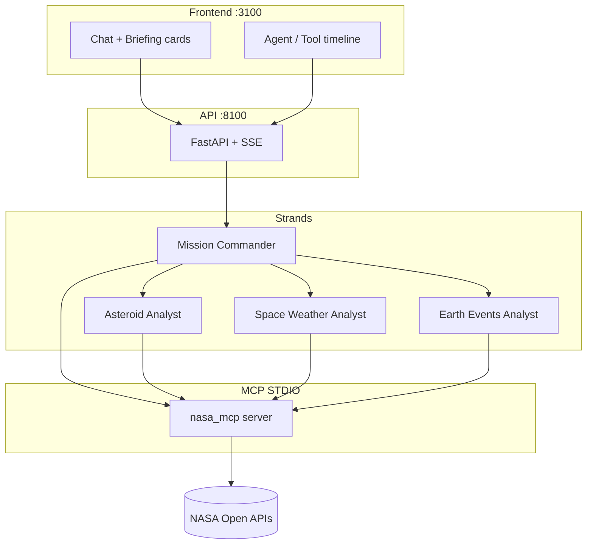

# NASA AI Mission Control

Portfolio showcase: **NASA MCP tools** + **Strands multi-agent orchestration** + **real-time Mission Control UI**.

**One-liner:** Near-Earth asteroids, space weather, Earth events, and APOD — discovered as MCP tools, delegated across specialist agents, and visualized live.

## Interview pitch

> I wrapped five NASA APIs as semantic MCP tools (not a generic REST proxy). On top, a Mission Commander delegates to three specialists via Strands agents-as-tools over MCP STDIO. A FastAPI/SSE bridge and Next.js console show agent/tool timelines in real time. LLM choice matches my other projects: Gemini or local Qwen — not OpenAI.

## Architecture



| Layer | Role |
|-------|------|
| `nasa_mcp` | Domain MCP tools, Pydantic structured output, caches |
| `agents` | Strands Commander + specialists (agents-as-tools) |
| `api` | HTTP/SSE bridge only (not an MCP proxy) |
| `frontend` | Chat, briefing cards, live telemetry |

### Why multi-agent?

A single prompt can drive all five tools. Multi-agent still earns its place:

1. **Enforced tool whitelists** per specialist (not prompt-only)
2. **Isolated domain prompts**
3. **Testable routing expectations** (`agents/routing.py`)
4. **Observable delegation** in the UI timeline

### Why Strands (not AutoGen)?

- AutoGen is in **maintenance mode**; new Microsoft work targets Agent Framework
- Strands speaks **MCP STDIO natively** and keeps agents-as-tools simple
- One orchestration stack is easier to defend in an interview

## MCP surface

| Tool | NASA source |
|------|-------------|
| `search_asteroids` | NeoWs feed |
| `get_asteroid` | NeoWs lookup |
| `get_space_weather` | DONKI (`ALL` fan-out supported) |
| `get_earth_events` | EONET v3 |
| `get_apod` | APOD |

Resources: `nasa://glossary`, `nasa://eonet/categories` · Prompt: `daily_mission_briefing`

**Agents:** Commander may call `get_apod` only among NASA tools; all asteroid work (including id detail) goes through **Asteroid Analyst**.

## Setup

Python **3.12+**, Node 18+ for the UI.

```bash
git clone <this-repo>
cd nasa-mcp
python -m venv .venv
source .venv/bin/activate
pip install -e ".[dev,agents,api,otel]"
cp .env.example .env
```

| Variable | Purpose |
|----------|---------|
| `NASA_API_KEY` | `DEMO_KEY` or registered key from [api.nasa.gov](https://api.nasa.gov/) |
| `LLM_PROVIDER` | `gemini` (default) or `qwen` — same as travel-rag |
| `GEMINI_MODEL` | Default `gemini-2.5-flash-lite` |
| `GEMINI_API_KEY` / `SECRETS_ENV_PATH` | Same as travel-rag (`~/.config/rag/.env`) |
| `QWEN_LLM` / `QWEN1B` / `QWEN8B` | Same as travel-rag (`1b` → `qwen3:1.7b-q4_K_M`) |
| `OLLAMA_BASE_URL` | Default `http://localhost:11434` |
| `OTEL_CONSOLE` | `1` to print OpenTelemetry spans/metrics |

Ports (avoid clash with travel-rag): API **8100**, Next.js **3100**.

## Run

### MCP Inspector

```bash
export NASA_API_KEY=DEMO_KEY
mcp dev src/nasa_mcp/server.py
```

### Multi-agent CLI

```bash
export LLM_PROVIDER=gemini
export OTEL_CONSOLE=1
python -m agents.cli "Give me a mission briefing for the next 7 days."
```

### Web console

```bash
# terminal 1
python -m api.main

# terminal 2
cd frontend && npm install && npm run dev
```

Open [http://localhost:3100](http://localhost:3100).

Full walkthrough: **[DEMO.md](./DEMO.md)**.

## Tests

Automated tests **never** call live NASA or a live LLM:

```bash
python -m pytest tests/ -q
```

Includes MCP/adapter mocks, agent whitelist tests, API SSE mocks, routing policy evaluation, telemetry ingest tests.

## Observability

With `OTEL_CONSOLE=1` and `.[otel]` installed:

- Spans: `agent.*`, `tool.*` (Commander → specialist → tool)
- Metrics: `nasa.tool.latency_ms` histogram, `nasa.errors` counter
- Console exporters only (Jaeger/OTLP optional later)

## Project layout

```text
src/nasa_mcp/     # MCP server + NASA clients
src/agents/       # Strands multi-agent + routing + tracing
src/api/          # FastAPI + SSE + Strands hooks bridge
frontend/         # Next.js Mission Control UI
tests/            # Mocked unit / contract tests
ROADMAP.md        # Phased plan
DEMO.md           # Interview demo script
spec.md           # Original MCP product spec
```

## Out of scope (by design)

Streamable HTTP transport, AutoGen, Redis/Postgres, auth, Docker, EPIC/Media Library tools, Leaflet map — see `ROADMAP.md` optional list.

## License / data

NASA API data is public; follow [api.nasa.gov](https://api.nasa.gov/) terms. This repo is a demonstration for portfolio use.
