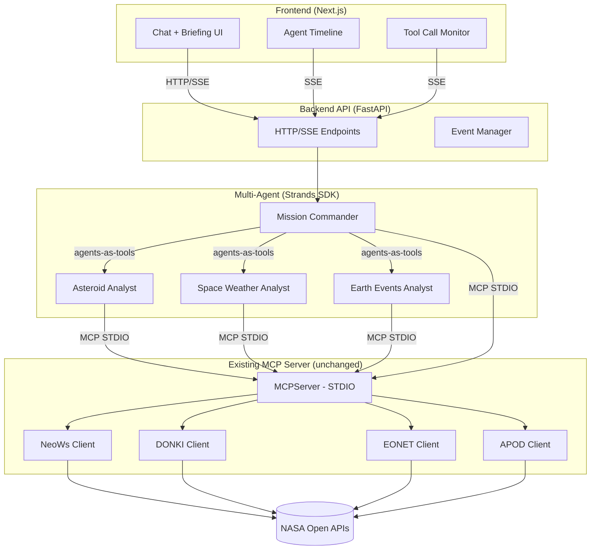

# NASA AI Mission Control — Development Roadmap

> **Goal:** Transform the existing NASA MCP server into a multi-agent AI Engineering
> showcase suitable for interview presentation.
>
> **Core principle:** The existing MCP server is preserved as-is; new layers are built on top.

---

## 1. Project Purpose and Goals

### What this is NOT

- A generic NASA REST API wrapper
- A full-scale production platform
- A framework collection trying to showcase as many tools as possible

### What this IS

An end-to-end working demo demonstrating the following technical competencies in a single project:

1. **MCP (Model Context Protocol):** Semantic domain tools, structured output, resources/prompts
2. **Multi-Agent Orchestration:** Strands SDK with agents-as-tools
3. **Real-Time Web Interface:** Agent timeline, briefing cards, tool call monitoring
4. **Observability:** OpenTelemetry tracing, latency metrics

### Interview pitch

> "I wrapped 5 NASA APIs as MCP tools. On top of that, I built a 4-agent orchestration
> with Strands. Each agent calls tools in its own domain; the Commander synthesizes results.
> The frontend shows the agent timeline in real time. The entire flow is traceable with OTel."

---

## 2. Assessment of the Current Architecture

### Existing components (all operational)

| Component | File(s) | Status |
|-----------|---------|--------|
| MCP Server | `src/nasa_mcp/server.py` | ✅ 5 tools, 2 resources, 1 prompt |
| Pydantic models | `src/nasa_mcp/models.py` | ✅ Asteroid, APOD, SpaceWeather, EarthEvent |
| NASA adapters | `src/nasa_mcp/clients/{neows,donki,eonet,apod}.py` | ✅ Shared HTTP, cache, retry |
| Base client | `src/nasa_mcp/clients/base.py` | ✅ TTLCache, backoff, key redaction |
| Validation | `src/nasa_mcp/validation.py` | ✅ bbox |
| Test suite | `tests/` (51 tests) | ✅ Mocked — no live NASA calls |

### What gets reused

- **MCP server stays unchanged.** Strands connects directly via STDIO.
- **Pydantic models** become the source for frontend TypeScript types.
- **Test infrastructure** is extended; fixtures are reused for agent tests.

### Technical constraints

| Constraint | Impact | Solution |
|-----------|--------|----------|
| STDIO transport | Frontend cannot connect directly | FastAPI BFF → Strands → MCP STDIO |
| DEMO_KEY rate limit | 30 req/hour | Registered NASA key or mock fixtures |
| Single process | No scaling | Sufficient for a portfolio demo |

---

## 3. Target System Architecture



### Layer responsibilities

| Layer | Responsibility | Why it exists |
|-------|---------------|---------------|
| MCP Server | NASA domain tools, structured output | Existing — unchanged |
| Strands Agents | Orchestration, delegation, synthesis | Multi-agent showcase |
| FastAPI | Next.js ↔ Strands HTTP/SSE bridge | Frontend cannot call Python directly |
| Next.js | User interface, agent visualization | Portfolio presentation |

> **Note:** FastAPI is NOT an MCP proxy. Its sole purpose is bridging the frontend to Strands over HTTP.

---

## 4. Technology Choices and Rationale

| Technology | Role | Why this one |
|-----------|------|-------------|
| **Strands SDK** | Multi-agent orchestration | Native MCP STDIO connection; agents-as-tools is simple and sufficient |
| **Gemini 2.5 Flash Lite** | LLM (cloud) | Low cost, fast; same provider as the travel-rag project |
| **Qwen 3 1.7B (Ollama)** | LLM (local/offline) | Free, local dev without API costs; same model as travel-rag |
| **FastAPI** | Backend API | Python-native; SSE/async built-in |
| **Next.js + TypeScript** | Frontend | SSR, Tailwind, portfolio standard |
| **Tailwind CSS** | Styling | Fast; mission-control theme |
| **SSE** | Real-time | Simpler than WebSocket; unidirectional stream is sufficient |
| **OpenTelemetry** | Tracing | Built into MCP SDK; compatible with Strands |

### LLM configuration (same as travel-rag)

| Mode | Model | Runtime | Config |
|------|-------|---------|--------|
| **Cloud** | `gemini-2.5-flash-lite` | Google GenAI API | `GEMINI_API_KEY` in `~/.config/rag/.env` |
| **Local** | `qwen3:1.7b-q4_K_M` | Ollama | `OLLAMA_BASE_URL`, no API key needed |

Default: Gemini (cloud). Switch to Qwen for offline development or to avoid API costs.
Strands SDK supports both via custom model provider configuration.

> **Not OpenAI.** No OpenAI dependency — Gemini or local Qwen only.

### Deliberately not chosen

| Technology | Why not |
|-----------|---------|
| **OpenAI** | Unnecessary cost; Gemini Flash Lite is cheaper and sufficient; Qwen local is free |
| **AutoGen** | In maintenance mode (Microsoft → Agent Framework). Mentioned as a comparison note in README, not added as code. |
| **LangGraph / CrewAI** | Strands is already MCP-native; extra framework adds unnecessary complexity |
| **WebSocket** | Bidirectional communication not needed; SSE is simpler |
| **Redis / PostgreSQL** | No state management needed; in-memory is sufficient |
| **Docker** | Local demo; containers unnecessary |

---

## 5. Development Phases and Dependencies

```text
Phase 0 ──► Phase 1 ──► Phase 2 ──► Phase 3 ──► Phase 4
 MCP E2E     Strands     FastAPI     Real-time    Observability
 validation  agents      + Next.js   viz          + showcase
```

Each phase depends on the completion of the previous one.
Each phase is independently testable and demoable.

---

## 6. Phase Details

---

### Phase 0 — Validate Existing MCP System

**Goal:** Confirm the existing MVP works correctly. No new code.

#### Tasks

- [x] `python -m pytest tests/ -q` — 51 tests green *(Agent: 2026-10-08)*
- [ ] `mcp dev src/nasa_mcp/server.py` — Inspector shows 5 tools, 2 resources, 1 prompt *(User — live)*
- [ ] `get_apod` returns real data *(User — live)*
- [ ] `get_space_weather` works with `ALL` and single types *(User — live)*
- [ ] `get_earth_events` lists open events *(User — live)*
- [ ] `search_asteroids` → `get_asteroid(id)` chain works (search → inspect) *(User — live)*
- [ ] Cursor MCP config connection works *(User — live)*

#### Acceptance criteria

"Give me a mission briefing for the next 7 days" in Inspector or Cursor calls all five
tools and produces a structured briefing.

#### File changes

None. Validation only. Agent runs mocked pytest only; live NASA / Inspector / Cursor are user-owned.

---

### Phase 1 — Strands Multi-Agent System

**Goal:** Terminal-based 4-agent orchestration using MCP tools.

#### Architectural decisions

- **Approach:** agents-as-tools (simplest Strands pattern)
- **Transport:** Strands → MCP STDIO (no HTTP conversion needed)
- **Commander** calls APOD directly (separate agent unnecessary)
- Migration to Graph/Swarm: only if proven necessary

#### Agents

| Agent | System Prompt Summary | Tool Whitelist (enforced, not just prompt) |
|-------|----------------------|----------------|
| **Mission Commander** | Analyze user request, delegate to specialists, synthesize results, call APOD directly | `get_apod` + specialist agent tools **only** |
| **Asteroid Analyst** | Asteroid and close-approach analysis, including detail lookups | `search_asteroids`, `get_asteroid` |
| **Space Weather Analyst** | Solar activity and space weather | `get_space_weather` |
| **Earth Events Analyst** | Natural disasters and Earth events | `get_earth_events` |

> **Tool whitelist is enforced at the agent level**, not just via system prompt instructions.
> Each agent is constructed with only its whitelisted tools — it cannot call tools outside its list.
> Commander does NOT have direct access to NASA tools other than `get_apod`.
> All asteroid queries (including single-ID lookups) go through the Asteroid Analyst.

#### Tasks

- [x] Create `src/agents/` directory structure
- [x] Add Strands SDK dependency to `pyproject.toml` (`optional-dependencies.agents`)
- [x] Configure LLM provider: Gemini (`gemini-2.5-flash-lite`) or Qwen (`qwen3:1.7b-q4_K_M` via Ollama)
- [x] Define MCP server config (Strands `MCPClient` + STDIO → `python -m nasa_mcp.server`)
- [x] `AsteroidAnalyst` agent: system prompt + `search_asteroids` / `get_asteroid`
- [x] `SpaceWeatherAnalyst` agent: system prompt + `get_space_weather`
- [x] `EarthEventsAnalyst` agent: system prompt + `get_earth_events`
- [x] `MissionCommander` agent: system prompt + specialists as tools + `get_apod`
- [x] Terminal demo script: `python -m agents.cli "Give me a mission briefing"`
- [ ] Verify specialists work independently (each testable in isolation) *(User)*
- [ ] Verify Commander → specialist delegation chain *(User)*
- [x] Timeout and error handling (NASA errors must not crash agents) *(CLI catches; specialists return grounded failures)*
- [ ] Unnecessary tool call check (simple query should not call all 5 tools) *(User / later eval)*
- [x] Agent tests: whitelist / filter unit tests in `tests/test_agents.py` (no live LLM)

#### Files to create

```
src/agents/
  __init__.py
  config.py              # MCP server config, LLM provider (Gemini / Qwen via Ollama)
  commander.py           # MissionCommander
  asteroid_analyst.py    # AsteroidAnalyst
  weather_analyst.py     # SpaceWeatherAnalyst
  earth_analyst.py       # EarthEventsAnalyst
  cli.py                 # Terminal demo entry point
tests/
  test_agents.py         # Agent delegation and routing tests
```

#### Acceptance criteria

```bash
python -m agents.cli "Are there any hazardous asteroids approaching Earth this week?"
```

In the terminal:
1. Commander receives the query
2. Delegates to AsteroidAnalyst
3. `search_asteroids` + `get_asteroid` are called
4. Commander summarizes the result

Full briefing: Commander calls 3 specialists + adds APOD itself.

#### Technical notes

- **Parallelism is not automatic.** agents-as-tools runs sequentially; parallel execution
  requires explicit `asyncio.gather` or Strands parallel execution mechanisms.
  We will measure this at the end of Phase 1.
- **Adding a new agent is not zero-cost.** Creating a new specialist is easy, but the
  Commander's system prompt and tool list must be updated.

---

### Phase 2 — FastAPI Backend + Next.js Frontend

**Goal:** Web application with chat interface, briefing cards, and real NASA results.

#### Tasks — Backend (FastAPI)

- [x] Create `src/api/` directory structure
- [x] Add FastAPI dependencies to `pyproject.toml` (`optional-dependencies.api`)
- [x] `POST /api/chat` — user message → returns `{ request_id }` (202 Accepted), starts Commander in background task
- [x] `GET /api/chat/{id}/events` — SSE stream; reads from buffered event queue (includes past events so late subscribers catch up)
- [x] Design event contract (extended in Phase 3 but interface defined now)
- [x] Define SSE lifecycle: background task writes events → queue → SSE reader drains; final `message` event carries the completed response
- [x] FastAPI runs on port **8100** (travel-rag uses 8000)
- [x] Request/response Pydantic models
- [x] CORS configuration (Next.js dev server)
- [x] Error handling (NASA timeout → meaningful user message)
- [x] Backend tests: mocked endpoint tests with `httpx.AsyncClient` (`tests/test_api.py`)

#### Event contract (shared across all phases)

```python
class AgentEvent(BaseModel):
    type: Literal[
        "agent_start", "agent_end",
        "tool_call", "tool_result",
        "status", "message",
        "error",
    ]
    agent: str              # "commander", "asteroid_analyst", ...
    timestamp: datetime
    data: dict[str, Any]    # tool name, arguments, result, error, etc.
    correlation_id: str     # Per-request correlation (= request_id)
```

> `status` replaces the earlier `thinking` event — it conveys observable agent state
> (e.g. "delegating to Asteroid Analyst", "synthesizing results") without exposing
> internal LLM reasoning. This contract is defined in Phase 2 and streamed via SSE in Phase 3.

#### SSE flow

```text
Client                          Server
  │                               │
  ├─ POST /api/chat ─────────►   │ → 202 { request_id: "abc" }
  │                               │   → spawn background task (Commander)
  ├─ GET  /api/chat/abc/events ─► │ → SSE stream (buffered: replays past events)
  │  ◄── agent_start commander    │
  │  ◄── agent_start asteroid_a.  │
  │  ◄── tool_call search_aster.  │
  │  ◄── tool_result …            │
  │  ◄── agent_end asteroid_a.    │
  │  ◄── …                        │
  │  ◄── message (final response) │
  │  ◄── (stream closes)          │
```

#### Tasks — Frontend (Next.js)

- [x] `frontend/` directory structure (Next.js + TypeScript + Tailwind, dev port **3100** — travel-rag uses 3000)
- [x] Chat component: send message, display response
- [x] Conversation history (in-memory, resets on reload — no DB)
- [x] Briefing cards:
  - [x] Asteroid list (id, name, hazard status, miss distance)
  - [x] Space Weather summary (event type, date, count)
  - [x] Earth Events list (title, category, status)
  - [x] APOD image (image/video + explanation)
- [x] Card data parsed from API `briefing` payload (NASA JSON is never parsed in FE; Phase 3 fills cards from tool events)
- [x] Dark theme / mission control aesthetic
- [x] TypeScript types: mirror of Pydantic models (manual; auto-codegen unnecessary)
- [x] Loading states and error handling

#### Files to create

```
src/api/
  __init__.py
  main.py                # FastAPI app
  routes.py              # /api/chat, /api/chat/{id}/events
  models.py              # Request/response + AgentEvent
  deps.py                # Commander agent instance

frontend/
  package.json
  tsconfig.json
  tailwind.config.ts
  src/
    app/
      page.tsx           # Main page
      layout.tsx         # Root layout (dark theme)
    components/
      Chat.tsx           # Message input + history
      BriefingCard.tsx   # Generic card wrapper
      AsteroidList.tsx   # Asteroid table
      WeatherSummary.tsx # Space weather summary
      EarthEvents.tsx    # EONET event list
      ApodCard.tsx       # APOD image card
    lib/
      api.ts             # fetch wrapper
      types.ts           # TypeScript types (Pydantic mirror)
```

#### Acceptance criteria

1. `http://localhost:3100` loads
2. "Mission briefing for this week" is typed in chat
3. Response appears as text + briefing cards
4. Clicking an asteroid row shows detail (search → inspect)

---

### Phase 3 — Real-time Agent Visualization

**Goal:** Make agent execution observable in real time.

#### Tasks — Backend

- [x] Convert Strands agent callbacks/hooks into `AgentEvent`s (`api/telemetry.py`)
- [x] Populate SSE endpoint with real event stream (`GET /api/chat/{id}/events`)
- [x] Calculate latency on each agent_start / agent_end event
- [x] Emit tool call start and result events
- [x] Include error events in the stream

#### Tasks — Frontend

- [x] Agent Timeline component:
  - [x] Which agent started/finished when (duration indicator)
  - [x] Active agent highlighting
- [x] Tool Call Monitor component:
  - [x] Called tool name and arguments
  - [x] Tool result summary
  - [x] Success/error status badge
- [x] Execution Timeline:
  - [x] Chronological event flow (agent_start → tool_call → tool_result → agent_end)
  - [x] Total execution time
- [x] SSE connection management (disconnect handling, reconnection)

#### Files to create

```
src/api/
  events.py              # SSE event manager, Strands hook integration

frontend/src/
  components/
    AgentTimeline.tsx     # Agent start/end timeline
    ToolCallMonitor.tsx   # Tool call details
    ExecutionTimeline.tsx # Chronological event flow
  hooks/
    useEventStream.ts    # SSE connection hook
```

#### Acceptance criteria

During a briefing request:
1. Agent timeline progresses in real time on the left panel
2. Commander → Asteroid Analyst → tool call → result flow is visible
3. Total execution time is displayed

---

### Phase 4 — Observability and Showcase

**Goal:** Elevate the project to a professional showcase.

#### Tasks — Observability

- [x] Add OpenTelemetry SDK dependency (on top of MCP SDK built-in traces) (`optional-dependencies.otel`)
- [x] Add spans to agent calls (Commander → Specialist → tool) (`agents/tracing.py` + telemetry hooks)
- [x] Tool call latency histogram (`nasa.tool.latency_ms`)
- [x] Simple console exporter (Jaeger/Zipkin optional; console sufficient for local demo)
- [x] Error rate metrics (`nasa.errors`)

#### Tasks — Evaluation (simple)

- [x] Deterministic test scenarios (mocked NASA + mocked LLM)
  - [x] "Any hazardous asteroids?" → Commander should delegate to AsteroidAnalyst
  - [x] "What's today's space picture?" → Commander should call APOD directly (no specialist needed)
  - [x] "Full briefing" → 3 specialists + APOD should be called
- [x] Unnecessary agent/tool call detection (simple assertions)
- [x] **Tool whitelist enforcement test:** verify each agent can only call its whitelisted tools (not just prompt-based — assert tool set at construction)
- [x] Latency baseline recording (reference values from first demo run) — table in `DEMO.md`

#### Tasks — Showcase

- [x] Update README: multi-agent architecture, running instructions, demo
- [x] Architecture diagram (Mermaid — final version of the diagram in this file)
- [x] Framework comparison note: "Why Strands, why not AutoGen"
- [x] "Why multi-agent?" justification in README (even though a single prompt would suffice)
- [x] Demo scenario: search → inspect → briefing (screenshots or GIF)
- [x] `DEMO.md` or step-by-step demo instructions in README

#### Files to create

```
src/agents/
  tracing.py             # OTel span helpers

tests/
  test_agent_routing.py  # Deterministic delegation tests
  test_api.py            # FastAPI endpoint tests (mocked agent)
```

#### Acceptance criteria

1. Console trace output: Commander → Specialist → tool → NASA (span chain)
2. Routing tests green (correct specialist, no unnecessary calls)
3. A new developer can set up and run the demo from README

---

## 7. File Inventory (Final State)

```
nasa-mcp/
├── src/
│   ├── nasa_mcp/              # Existing — unchanged
│   │   ├── server.py
│   │   ├── models.py
│   │   ├── validation.py
│   │   └── clients/
│   │       ├── base.py
│   │       ├── neows.py
│   │       ├── donki.py
│   │       ├── eonet.py
│   │       └── apod.py
│   ├── agents/                # Phase 1 — NEW
│   │   ├── __init__.py
│   │   ├── config.py
│   │   ├── commander.py
│   │   ├── asteroid_analyst.py
│   │   ├── weather_analyst.py
│   │   ├── earth_analyst.py
│   │   ├── tracing.py         # Phase 4
│   │   └── cli.py
│   └── api/                   # Phase 2 — NEW
│       ├── __init__.py
│       ├── main.py
│       ├── routes.py
│       ├── models.py
│       ├── deps.py
│       └── events.py          # Phase 3
├── frontend/                  # Phase 2 — NEW
│   ├── package.json
│   ├── tsconfig.json
│   ├── tailwind.config.ts
│   └── src/
│       ├── app/
│       │   ├── page.tsx
│       │   └── layout.tsx
│       ├── components/
│       │   ├── Chat.tsx
│       │   ├── BriefingCard.tsx
│       │   ├── AsteroidList.tsx
│       │   ├── WeatherSummary.tsx
│       │   ├── EarthEvents.tsx
│       │   ├── ApodCard.tsx
│       │   ├── AgentTimeline.tsx       # Phase 3
│       │   ├── ToolCallMonitor.tsx     # Phase 3
│       │   └── ExecutionTimeline.tsx   # Phase 3
│       ├── hooks/
│       │   └── useEventStream.ts       # Phase 3
│       └── lib/
│           ├── api.ts
│           └── types.ts
├── tests/
│   ├── test_clients.py        # Existing
│   ├── test_server.py         # Existing
│   ├── test_models.py         # Existing
│   ├── test_adapters.py       # Existing
│   ├── test_donki.py          # Existing
│   ├── test_lifespan.py       # Existing
│   ├── test_agents.py         # Phase 1 — NEW
│   ├── test_agent_routing.py  # Phase 4 — NEW
│   ├── test_api.py            # Phase 4 — NEW
│   └── fixtures/              # Existing
├── pyproject.toml
├── README.md
├── ROADMAP.md
├── planning.md
├── spec.md
└── .env.example
```

---

## 8. Test Strategy

### Principles

- Automated tests **never** call live NASA APIs.
- LLM calls are mocked in deterministic tests.
- Each phase brings its own test set.

### Test pyramid

```text
                    Manual Demo
                   (Inspector + Cursor + Web UI)
                        ▲
                       / \
                Agent Routing Tests
               (mocked LLM + mocked MCP)
                    /         \
            MCP Contract Tests      API Endpoint Tests
           (Client(mcp) + mock)    (httpx + mock agent)
                /                       \
        NASA Adapter Unit Tests      Frontend Unit Tests
       (mocked httpx2 transport)   (component render tests)
```

### Test coverage by phase

| Phase | Test file | What it tests |
|-------|-----------|--------------|
| 0 | Existing 51 tests | Adapters, MCP contracts, models, lifespan |
| 1 | `test_agents.py` | Commander delegation, specialist tool selection |
| 2 | `test_api.py` | FastAPI endpoints (mocked Commander) |
| 3 | (Frontend unit tests) | Component rendering, SSE hook |
| 4 | `test_agent_routing.py` | Unnecessary agent/tool call detection |

---

## 9. Technical Risks and Mitigations

| Risk | Impact | Likelihood | Mitigation |
|------|--------|-----------|-----------|
| Strands MCP STDIO connection doesn't work as expected | Phase 1 blocked | Low | Verify connection as Phase 1's first task; subprocess wrapper if needed |
| NASA DEMO_KEY rate limit | Timeout during demo | Medium | Use registered key; keep demo fixtures ready |
| LLM cost (Gemini API calls) | Development and demo expense | Low | Gemini Flash Lite is cheap; switch to local Qwen for dev; mock LLM in tests |
| No parallelism in agents-as-tools | Briefing is slow | Medium | Measure; use `asyncio.gather` or Strands parallel exec if needed |
| Strands SDK API changes | Code breaks | Low | Pin version; lock SDK dependency |
| SSE connection stability | Timeline interruptions | Low | Reconnect logic + buffered events |
| Interview "why multi-agent?" question | Defense needed | High | Clear justification in README; "single prompt works too, but…" argument prepared |

---

## 10. MVP Scope and Optional Enhancements

### MVP (sufficient for interview)

- [x] MCP server (5 tools, 2 resources, 1 prompt)
- [x] Strands 4 agents (agents-as-tools)
- [x] FastAPI BFF + basic Next.js
- [x] Agent timeline (SSE)
- [x] Console OTel trace
- [x] Routing accuracy tests

### Optional (post-MVP)

| Feature | Value | Effort |
|---------|-------|--------|
| Leaflet map (Earth Events) | High visual impact | Medium |
| EPIC (Earth imagery) tool | New NASA data source | Low |
| NASA Media Library tool | Rich media | Low |
| Jaeger/Zipkin exporter | Professional tracing UI | Low |
| Streamable HTTP transport | Production-ready | High |
| Docker Compose | Single-command startup | Low |
| Parallel specialist execution | Latency improvement | Medium |
| Graph-based orchestration | Complex workflows | High |

---

## 11. End-to-End Demo Scenario

### Scenario: "Mission briefing for this week"

```
User: Are there any hazardous asteroids approaching Earth this week?
      Also show space weather and active natural events.

[Frontend — Chat panel]
Message is sent.

[Backend — FastAPI]
POST /api/chat → Commander agent starts.

[Agent Timeline — Real-time]
🟢 Mission Commander started
  ├─ 🟡 Asteroid Analyst started
  │    ├─ 🔧 search_asteroids(start_date=..., end_date=..., hazardous_only=true)
  │    │    └─ ✅ 3 asteroids found
  │    ├─ 🔧 get_asteroid(id="2465633")  ← closest PHA
  │    │    └─ ✅ detail retrieved
  │    └─ ✅ Asteroid Analyst completed (1.2s)
  ├─ 🟡 Space Weather Analyst started
  │    ├─ 🔧 get_space_weather(event_type="ALL", ...)
  │    │    └─ ✅ 5 events (2 CME, 1 FLR, 2 GST)
  │    └─ ✅ Space Weather Analyst completed (0.8s)
  ├─ 🟡 Earth Events Analyst started
  │    ├─ 🔧 get_earth_events(days=7, status="open")
  │    │    └─ ✅ 4 events (2 wildfires, 1 storm, 1 volcano)
  │    └─ ✅ Earth Events Analyst completed (0.6s)
  ├─ 🔧 get_apod()  ← Commander calls directly
  │    └─ ✅ "The Lagoon Nebula"
  └─ ✅ Mission Commander completed (3.8s)

[Frontend — Briefing Cards]
┌──────────────────────────────────────────┐
│ 🌍 Mission Briefing — Oct 8–15, 2026    │
├──────────────────────────────────────────┤
│ ☄️ Asteroid Report                       │
│ 3 close approaches, 1 PHA: 465633       │
│ Miss distance: 500,000 km               │
│ [Detail →]                               │
├──────────────────────────────────────────┤
│ ☀️ Space Weather                         │
│ 2 CME, 1 Solar Flare, 2 Geomagn. Storm  │
├──────────────────────────────────────────┤
│ 🌋 Earth Events                          │
│ 2 wildfires, 1 storm, 1 volcano         │
├──────────────────────────────────────────┤
│ 🔭 Picture of the Day                    │
│ [The Lagoon Nebula image]                │
└──────────────────────────────────────────┘
```

### Search → Inspect drill-down

```
User: "Tell me more about 465633"

Commander: delegates to Asteroid Analyst
Asteroid Analyst: get_asteroid(id="2465633")

Card updates:
  Orbital period: 643 days
  Absolute magnitude: 20.44
  Known close approaches: 2 records
```

---

## 12. Checkpoints

A brief evaluation is conducted at the end of each phase:

| Phase | Question | Expected answer |
|-------|----------|----------------|
| 0 | Is the MCP server solid? | 51 tests green + Inspector demo working |
| 1 | Does agent orchestration work? | 4 agents produce a briefing in terminal |
| 2 | Does the web UI work? | Chat + briefing cards with real data |
| 3 | Is the agent flow visible? | SSE timeline in real time |
| 4 | Is it interview-ready? | README sufficient, traces visible, tests green |

**Phases 0–4 agent code: complete.** Remaining work is user live demo per `DEMO.md`.

---

> **Note:** All values in the demo scenario above (asteroid counts, event counts, distances,
> latency times) are **illustrative examples**. Actual results depend on live NASA data at
> query time.
